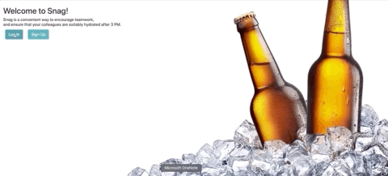

# Snag

[Live site](https://snagbeer.herokuapp.com)

[Demo](https://youtu.be/hxw_Ck8Glc4)

## About

Inspired by WeWork's beer on tap building, users can sign in and request beers from colleagues (request a snag) that are going downstairs, specifying their current location and the type of beer they want delivered. Colleagues can then snag a beer for their friends and deliver it.

Snag is the result of Flatiron School's Ruby on Rails module.

## Technology

- Ruby on Rails
- HTML / CSS / Bootstrap
- PostgreSQL
- Heroku
- Sorcery for authentification

## Features

Users can log in and see an estimate of the amount of beer available in each keg, per floor. They can also see any snag requests pending.

Users can request a snag - request a beer from colleagues going downstairs.

Users can snag a beer from their colleages and then deliver it to their required area.

After delivering the beer, users will report the state of the keg and the cups in the corresponding floor. The keg and cup levels shown on the homepage will change accordingly.

Users can also learn about the beers available and see the leaderboard of snags/requests per user.

**Project created by Pat Santucci & Ines Guerrero**
